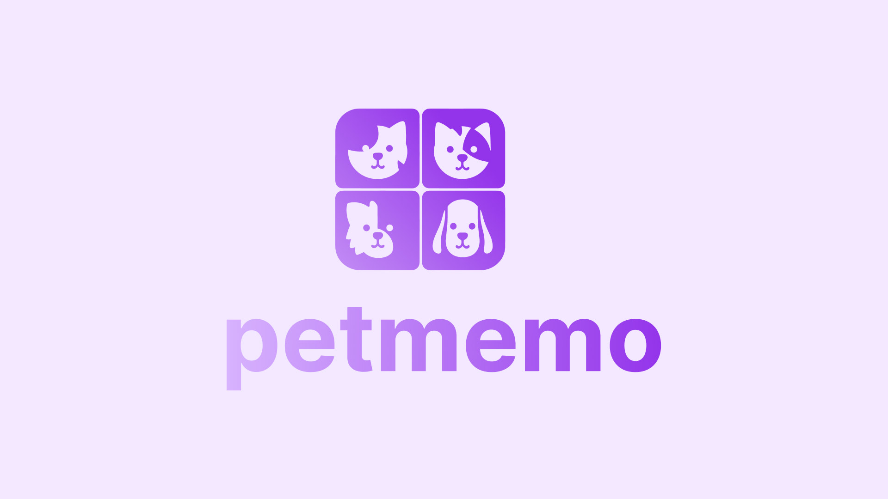

A showcase application built with Vite and React. Powered by [The Cats API](https://thecatapi.com/).

[Live demo](https://petmemo-sarneeh.vercel.app/)

## Prerequisities

Important! The Cats API does only support filtering with query parameters when used with an API key. If you want to run the app locally, you need to grab a key from the [Cats API](https://thecatapi.com) website and put it in a `.env` file, like this:

```
VITE_API_KEY=YOUR_KEY_HERE
```

### What exactly does not work?

The *limit* query parameter does not work without an API key and always returns 10 entries. I didn't want to hack around this as this is a bad practice.

Example: https://api.thecatapi.com/v1/images/search?limit=2

## How to run

### Run in development mode

```
pnpm install
pnpm dev
```

### Run in production mode

```
pnpm build
pnpm preview
```

## Technology

Following libraries and technologies were used in this project:

- [React](https://github.com/facebook/react) - UI Library
- [React Router](https://github.com/remix-run/react-router) - Routing
- [Zustand](https://github.com/pmndrs/zustand) - State Management
- [UnoCSS](https://github.com/unocss/unocss) - CSS Framework
- [Ky](https://github.com/sindresorhus/ky) - HTTP Client

### Rationale

#### Zustand

I heard a lot about Zustand and it's simplicity. As I never had the opportunity to work with it, I decided to check out its capabilities in this project. What I was looking for in a state management for this project was high React integration (e.g. state selector hooks out of the box), strategies for preventing rerenders and easy nested state updates (e.g. [integration with immer](https://github.com/pmndrs/zustand#sick-of-reducers-and-changing-nested-states-use-immer)).

#### UnoCSS

I love the Utility CSS approach and found out that it's very effective in prototyping and generally fast development. It gives a lot of performance benefits out of the box as you only fetch the CSS you use in your markup, and the reusability level is very high. I did choose UnoCSS over [Tailwind](https://tailwindcss.com/) as it is a lot faster (vs Tailwind's JIT), more customizable, and gives some cool features out of the box like e.g. [pure css icons](https://antfu.me/posts/icons-in-pure-css).

## Assets

Icons have been taken from an open-source project called [Lucide](https://lucide.dev/). Integrated easily with the brilliant [UnoCSS icons preset](https://unocss.dev/presets/icons).

## Architecture

For a detailed description and overview of the architecture, check [this document](docs/architecture.md).

## Shortcomings / Todo List

A list of issues and things that I'm aware of that should be improved to make the project production-ready.

### Unit tests

There are no unit tests. No tests for the domain logic, no tests for the UI components. This should be surely addressed.

### End-to-end tests

Like above, it would be great to have some end-to-end tests of the app. If so, I'd probably suggest Cypress.

### Semantic HTML

To be honest, I didn't care about it too much knowing the time limitations so I spammed `div`'s wherever I could 😅 There are certainly some places for improvement here.

### UI / UX

There are a few problems and places which could be improved:

- accessibility
- keyboard navigation

### Continuous integration / Continuous deployment

Would be great to have basic build/test/lint/typecheck GitHub Actions that could check stuff every commit without the need to do it locally.

### Bugs

- I run into an issue with the grid on Safari - it renders initially stretched out and fixes itself on interaction (without any rerender). This seems like a Safari bug in a grid + aspect-ratio scenario. I tried to fix this issue but after a few hours I gave up and left it as is as I had to finish other elements of the solution ☹️

### Other improvements / ideas

- limited time for each turn (counter)
- setting to choose between cats/dogs
- multiplayer online (lobby system)
   - player profiles
   - player leaderboards
   - tournamets

