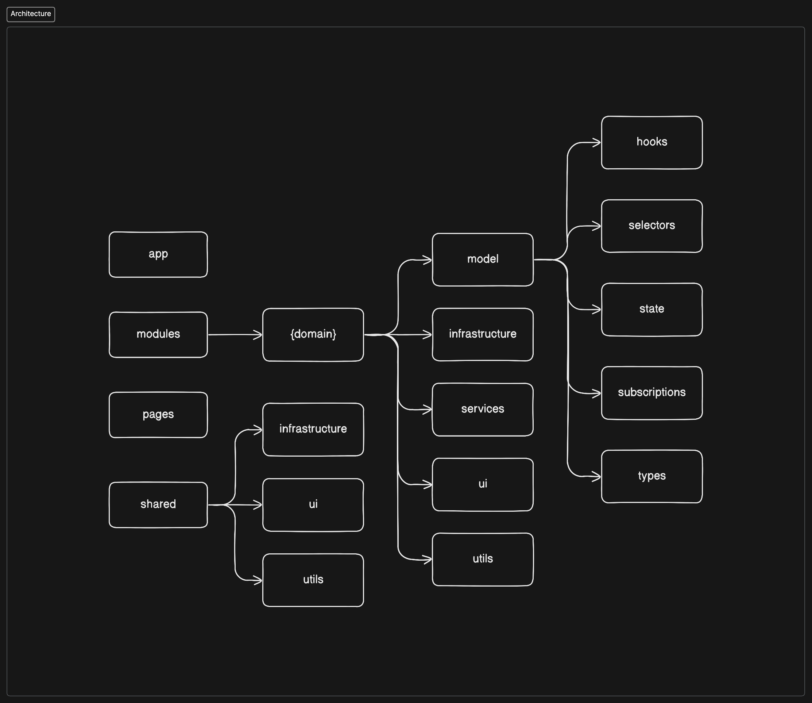

# petmemo

This is a document describing the architecture, known limitations and shortcomings of the [petmemo](https://github.com/sarneeh/petmemo) game. You will learn about how the application has been structured and what was the idea and rationale behind it.

# Architecture

## Inspiration

The architecture is inspired by a few resources found in the web:

- [Feature-Sliced Design](https://feature-sliced.design/)
- [Khalil Stemmler - Client-Side Architecture](https://khalilstemmler.com/articles/client-side-architecture/introduction/)
- [Juan Otálora - Folder structure in a React hexagonal architecture](https://dev.to/juanoa/folder-structure-in-a-react-hexagonal-architecture-h77)

It does not strictly follow any of those suggestions, but it's inspired by some ideas from each of them to compose a solution that suits the needs of the project.

## Structure

The app is devided in 4 base layers: **app, modules, pages** and **shared**. Some of the layers have sub-layers (modules, shared) and some are flat (app, pages).

You can find detailed information about each of the layers (and its sub-layers) below.

### App

Simple, flat layer where we put all app-wide settings, styles, providers, routing etc. Elements of this layers should not be related to any domain logic of the application and suit mostly for app bootstrap.

### Modules

The core of the whole application. It consists of domain slices that are separated in sub-layers, similar to the [shared](#shared) layer. Elements from this layer are used to build up whole pages in the [pages](#pages) layer.

#### Model

This sub-layer consists of multiple elements related to the domain slice:

- `state` - state management store, consists of module **state** (data) and **actions** (app events)
- `selectors` - reusable state selectors
- `hooks` - React hooks that encapsulate some of the app state selection and actions (domain logic) for increased testability
- `subscriptions` - state subscription creators to simplify implementation of state change side-effects and increase reusability
- `types` - TypeScript types and interfaces related to the domain slice

Those are building blocks that encapsulate some of the domain logic to decrease inlined domain logic in the module [ui](#ui) components.

#### Infrastructure

Infrastructure elements related to the domain. Often composed from reusable elements from `shared/infrastructure`.

Examples: `CardRepository`, `CardAPIClient`

#### Services

Classes that help decouple some of the domain logic. Ideally split to as small chunks as possible to allow easier testability and reusability.

#### UI

Domain-related components, often "smart" with logic in it.

Examples: `GameBoardCard`, `GameStartButton`

#### Utils

Helper functions related to the domain that do not fit directly to any service or that may be used by multiple services.

Examples: `isCardRevealed`

### Pages

Compositional layer that consists of components that construct full pages from various app modules. Should not contain any domain logic.

### Shared

Shared layer that consists of elements that are not related to any domain.

#### Infrastructure

Reusable infrastructure elements like API clients, state managament addons.

Examples: pre-configured API client with error handling, interceptors, state management offline storage hooks

#### UI

Reusable pure components not related to any domain logic.

Examples: `Button`, `Card`

#### Utils

Reusable helper functions not related to any domain logic.

Examples: `replaceItemAtIndex`, `preloadImages`

## Rules

There are a few rules that need to be followed so that the architecture would make sense and so it wouldn't provide more problems than benefits:

- All of the `modules` should have clear entrypoints and only those entrypoints should be used. This ensures encapsulation and usage only of the publicly exposed interfaces. Example:
   - bad: `import { GameCard } from '@/modules/game/ui/GameCard'`
   - good: `import { GameCard } from '@/modules/game'`
- There should be clear importing rules throughout the different layers to prevent unwanted situations like:
   - `app` importing from the `modules` layer
   - `pages` importing from `app` layer
   - `modules` importing from `pages` layer

### Automation

Humans are bad in remembering things and ensuring everything is in the right order. When there are tight deadlines - everything will eventually fall apart 🙂 To prevent this, we should automate the process as much as possible to ensure architecture consistency.

For this, petmemo is using a great eslint plugin called [eslint-plugin-boundaries](https://github.com/javierbrea/eslint-plugin-boundaries), which [properly configured](https://github.com/sarneeh/petmemo/blob/main/.eslintrc.cjs#L81-L116) can automate checking the rules described above.

## Rationale

This architecture is something I've been working on on various project and it's still an in-progress. It's definitely scaling a lot better than the most common flat components/containers approach and results in a lot better code structure thanks to the separation of domain elements.

The biggest benefits that I've found comparing to other architectures is:

- clear distinction between UI and general logic that's tied to some kind of a domain or if it's for general purpose
- better testability and maintainability of the domain logic
   - thanks to splitting the domain into reusable hooks/services/selectors you can test small chunks of logic with a small (or none at all) amount of mocking
- easily extendable
- can be easily split into multiple packages
   - thanks to the `modules/*` approach with clear entrypoints (public interfaces) you can easily split this code to a separate npm package that could be reused in an another application
   - `shared/*` could also be split to a separate package

It's definitely not perfect and it might not be as scalable for a lot bigger projects (didn't had the opportunity to test it out in this kind of scenario yet), but it works fine in small-mid sizes ones for sure.

For bigger sized projects I'd definitely try out to integrate [https://nx.dev/](https://nx.dev/).